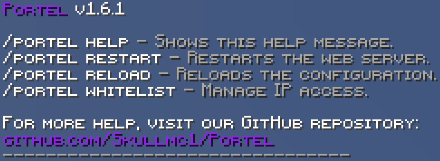

<div align="center">
  
</div>


## Websites hosted directly on Minecraft servers

Portel is a Minecraft plugin that allows you to host a simple website directly from your server. It starts a lightweight web server that serves files from a folder within the plugin's configuration directory.

## Why use Portel?

-   **Simplicity:** Portel is designed to be easy to use. Simply drop the plugin into your server's `plugins` folder and you're ready to go. No complex setup or configuration required.
-   **Performance:** Portel is built to be lightweight and efficient. It uses Java's built-in HTTP server to minimize resource usage, ensuring that your server's performance is not affected.
-   **Customization:** Portel gives you full control over your website. You can create your own HTML, CSS, and JavaScript files to build a unique website that reflects your server's identity. You can also create custom error pages for 403, 404, and 429 errors.
-   **Security:** Portel includes a whitelist/blacklist system to control access to your website. It also has a path-traversal protection and a rate-limiting feature to prevent abuse.
-   **Real-time updates:** Changes to your website files are reflected in real-time with automatic **Hot-Reloading**.
-   **No external hosting required:** Host your website directly on your Minecraft server, eliminating the need for a separate web hosting service.

## Configuration

The configuration file is located at `plugins/Portel/config.yml`.

```yaml
port: 8080
websocket-port: 8081
index-file: index.html
# Automatically clear cache when files in web/ directory are modified.
hot-reloading: true

ssl:
  enabled: false
  keystore-path: "keystore.jks"
  keystore-password: "password"

websocket:
  # Enable web users to send messages to the Minecraft server
  allow-web-to-game-chat: true
  # Formatting for web-to-game messages
  chat-prefix: "[Web] "
  prefix-color: "DARK_PURPLE"
  message-color: "LIGHT_PURPLE"

logging:
  # Enable console logging
  console: true
  # Enable IP logging to a file
  ip: true
  # File name for IP logging
  ip-log-file: "ips.log"
```

## Commands

-   `/portel help` - Shows the interactive help message.
-   `/portel restart` - Restarts the web server.
    -   Permission: `portel.restart`
-   `/portel reload` - Reloads the configuration.
    -   Permission: `portel.reload`
-   `/portel version` - Displays the current version.
-   `/portel whitelist <add/remove/list/on/off> [ip]` - Manage IP access.
    -   Permission: `portel.admin`

## Guides

-   [WebSocket Support](guides/websocket.md) - Learn how to use the real-time chat feature.
-   [PlaceholderAPI Support](guides/placeholders.md) - Integrate dynamic server information into your web pages.
-   [HTTPS/SSL Support](guides/ssl.md) - Secure your web server with SSL certificates.

## Building from source

To build the plugin from source, you will need to have Java 21 and Gradle installed.

1.  Clone the repository: `git clone https://github.com/Skullmc1/Portel.git`
2.  Navigate to the project directory: `cd Portel`
3.  Build the plugin: `./gradlew shadowJar`

The compiled `.jar` file will be located in the `build/libs` directory.

## Contributing

Contributions are welcome! If you have any ideas, suggestions, or bug reports, please open an issue or create a pull request.

## License

This project is licensed under the MIT License - see the [LICENSE](LICENSE) file for details.
<div align="center">
  
</div>
