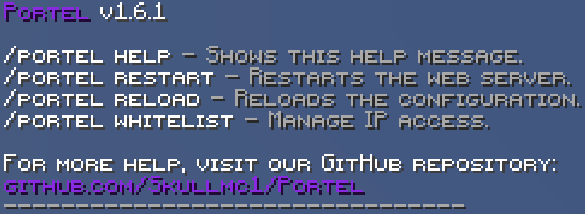

<div align="center">
  
</div>


## Websites hosted directly on Minecraft servers

**Built for Minecraft:** <!-- mc-version -->26.3<!-- /mc-version --> (Paper, Java 25+)

Portel is a Minecraft plugin that allows you to host a simple website directly from your server. It starts a lightweight web server that serves files from a folder within the plugin's configuration directory.

## Features

-   **Simple setup:** Drop the plugin into your `plugins` folder and start the server. A default website is generated for you in `plugins/Portel/web`.
-   **Lightweight:** Built on Java's built-in HTTP server, so there is no heavy web stack to run.
-   **Fully customizable:** Serve your own HTML, CSS, JavaScript and assets, with custom error pages for 403, 404 and 429.
-   **Hot-reloading:** Edits to files in `web/` are picked up automatically, with no restart needed.
-   **Live chat over WebSocket:** Show in-game chat on your site and let web visitors send messages into the game. See the [WebSocket guide](guides/websocket.md).
-   **PlaceholderAPI support:** Use placeholders such as `%server_online%` directly in your HTML. See the [placeholders guide](guides/placeholders.md).
-   **HTTPS/SSL:** Serve your site over `https://` using a keystore. See the [SSL guide](guides/ssl.md).
-   **Access control:** IP whitelist/blacklist, path-traversal protection and rate limiting.
-   **Logging:** Optional console logging and IP logging to a file.

## Configuration

The configuration file is located at `plugins/Portel/config.yml`.

```yaml
port: 8080
websocket-port: 8081
index-file: index.html
# Automatically clear cache when files in web/ directory are modified.
hot-reloading: true

ssl:
  enabled: false
  keystore-path: "keystore.jks"
  keystore-password: "password"

websocket:
  # Enable web users to send messages to the Minecraft server
  allow-web-to-game-chat: true
  # Formatting for web-to-game messages
  chat-prefix: "[Portel] * "
  prefix-color: "DARK_PURPLE"
  message-color: "LIGHT_PURPLE"

logging:
  # Enable console logging
  console: true
  # Enable IP logging to a file
  ip: true
  # File name for IP logging
  ip-log-file: "ips.log"
```

Make sure `port` and `websocket-port` are open on your host and differ from the Minecraft port (default 25565).

## Commands

Alias: `/p`

-   `/portel help` - Shows the interactive help message.
-   `/portel restart` - Restarts the web server.
    -   Permission: `portel.restart`
-   `/portel reload` - Reloads the configuration.
    -   Permission: `portel.reload`
-   `/portel version` - Displays the current version.
-   `/portel whitelist <add/remove/list/on/off> [ip]` - Manage the IP list. `on` allows only listed IPs; `off` blocks listed IPs instead.
    -   Permission: `portel.admin`
-   `/portel blacklist ...` - Alias for `whitelist` (Portel uses a single IP list; run `whitelist off` to treat it as a blacklist).
    -   Permission: `portel.admin`

## Guides

-   [WebSocket Support](guides/websocket.md) - Learn how to use the real-time chat feature.
-   [PlaceholderAPI Support](guides/placeholders.md) - Integrate dynamic server information into your web pages.
-   [HTTPS/SSL Support](guides/ssl.md) - Secure your web server with SSL certificates.

## Building from source

To build the plugin from source, you will need to have Java 25 installed (the included Gradle wrapper handles Gradle).

1.  Clone the repository: `git clone https://github.com/Skullmc1/Portel.git`
2.  Navigate to the project directory: `cd Portel`
3.  Build the plugin: `./gradlew shadowJar`

The compiled `.jar` file will be located in the `build/libs` directory.

## Contributing

Contributions are welcome! If you have any ideas, suggestions, or bug reports, please open an issue or create a pull request.

## License

This project is licensed under the MIT License - see the [LICENSE](LICENSE) file for details.
<div align="center">
  
</div>
